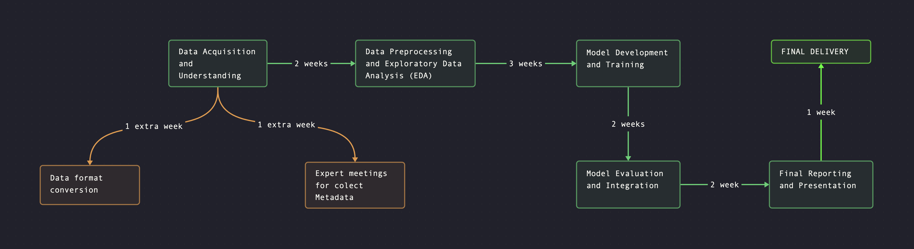

### **1. Introduction**

#### **Context of the Project**

The COVID-19 pandemic continues to challenge healthcare systems worldwide, with diabetic patients emerging as one of the most vulnerable groups. Due to compromised immune systems and other underlying conditions, individuals with diabetes are at a significantly higher risk of severe complications, prolonged hospitalization, and mortality when infected with COVID-19.

This project specifically focuses on diabetic patients aged 40-60—a key demographic due to their dual vulnerability and societal role. This age group represents a substantial portion of the working population, meaning that mitigating their risk not only saves lives but also preserves healthcare resources and supports societal productivity.

#### **Problem Statement**

The primary goal of this project is to develop a machine learning model that can predict which diabetic inpatients are most at risk of developing severe COVID-19 complications. By identifying these high-risk patients early, hospitals can implement timely interventions, reduce ICU admissions, and optimize resource allocation. This approach not only enhances patient outcomes but also helps alleviate the financial burden on healthcare systems by reducing unnecessary treatments and extended hospital stays.

#### **Why Focus on Diabetic Patients?**

Diabetic patients are disproportionately affected by COVID-19, facing a combination of factors that make them more susceptible to severe outcomes:

1. **Compromised Immune System:**
    
    - **Weakened Defense Against Infections:** Diabetes impairs immune function, making it harder to fight off infections like COVID-19.
    - **Chronic Inflammation:** Elevated blood sugar levels exacerbate inflammation, heightening the risk of severe symptoms.
2. **Higher Risk of Complications:**
    
    - **Increased Mortality and ICU Admissions:** Diabetics have higher rates of severe disease progression, ICU admissions, and mortality.
    - **Faster Deterioration:** Their condition can escalate rapidly from mild symptoms to life-threatening complications.
3. **Additional Comorbidities:**
    
    - **Cardiovascular Disease and Obesity:** These conditions, often present in diabetic patients, further increase the likelihood of severe illness.
4. **Challenges in Blood Sugar Management:**
    
    - **Metabolic Instability:** COVID-19 often disrupts glycemic control, complicating treatment for both diabetes and the viral infection.
    - **Drug Interactions:** Antidiabetic medications may interact with COVID-19 treatments, necessitating more complex care.
5. **Increased Demand for Healthcare Resources:**
    
    - **Intensive Care Needs:** Diabetic patients are more likely to require mechanical ventilation and extended ICU stays.
    - **Prolonged Hospitalization:** Complications lead to longer hospital stays, further straining healthcare capacity.

#### **Stakeholders**

- **Hospitals and Healthcare Providers:** Predicting severe COVID-19 outcomes in diabetic patients enables healthcare providers to prioritize care, reduce ICU strain, and improve patient survival rates.
  

## **2. Cost/Benefit Analysis for Hospitals**

### **Benefits**

1. **Improved Healthcare Resource Allocation**
    
    - **Optimized ICU Use:** The model allows hospitals to predict which diabetic patients will need ICU care, ensuring critical resources like ICU beds are reserved for those at greatest risk.
    - **Staff Allocation:** Predictive insights enable better staff scheduling, ensuring that specialized personnel are available for high-risk patients, improving care efficiency.
2. **Reduction in ICU Admissions**
    
    - **Estimated Reduction:** The predictive model aims for a 20% decrease in ICU admissions among diabetic patients aged 40-60, easing the strain on critical care units.
    - **Financial Impact:** Each ICU stay costs approximately $45,000 per patient. By reducing ICU admissions, hospitals can achieve notable financial savings.
3. **Better Patient Care**
    
    - **Early Interventions:** Early detection of high-risk patients allows for proactive, targeted treatment, reducing complications and improving survival rates.
    - **Personalized Care Plans:** Hospitals can create tailored care plans based on the patient’s risk profile, ensuring more effective management of both COVID-19 and diabetes.
4. **Significant Financial Savings**
    
    - **Cost Savings on ICU Stays:** With a reduction of 30 ICU admissions annually, potential savings amount to **$1,350,000** per year.

### **Costs**

1. **Development and Implementation**
    
    - **Staffing Costs:** Salaries for data scientists, software developers, and data engineers to build, test, and deploy the model.
    - **Technical Infrastructure:** Computational resources, software licenses, and secure data storage for handling patient records and model computation.
2. **Staff Training**
    
    - **Training Programs:** Training healthcare staff to understand the model’s outputs and integrate them into patient care.
    - **Time Costs:** Time allocated for staff training sessions.
3. **Ongoing Maintenance**
    
    - **Model Updates:** Continuous model improvement and updating with new data as COVID-19 evolves.
    - **Technical Support:** Routine maintenance to ensure the model operates smoothly and reliably in hospital systems.

### **Return on Investment (ROI)**

- **Initial Investment:** Estimated cost for developing, implementing, and maintaining the model is **$169,000**.
    
- **Annual Savings:** Based on the reduction of ICU admissions, the projected annual savings for the hospital are **$1,350,000**.
    
- **ROI Calculation:**
    
    ROI=(1,350,000−169,000)169,000×100≈699%

The high ROI (approximately **699%**) demonstrates the financial viability of the project. By preventing severe COVID-19 cases in diabetic patients, the benefits vastly outweigh the costs, making this a highly attractive solution for hospitals seeking to reduce ICU strain and enhance patient outcomes.

## **3. Framing the Problem as a Data Science Task**

### **Objective**

Our objective is to develop a predictive model to forecast severe COVID-19 illnesses in diabetic patients aged 40-60. Severe cases will be defined by specific clinical criteria such as:

1. The need for intubation.
2. Requirement for mechanical ventilation.
3. Hospitalization in general wards.
4. Admission to an Intensive Care Unit (ICU).

The goal of this model is to provide healthcare professionals with a tool that allows for **early identification** of high-risk diabetic patients, enabling **timely interventions**. This will help optimize the allocation of **hospital resources** and improve **patient outcomes**.

The predictions will be based on a combination of **demographic, clinical, and hospital admission data**, which will be processed through a **reproducible and interpretable** machine learning pipeline.

### **Data**

For this project, we will leverage a wide array of data types to create a holistic and accurate prediction model. Below, we outline the key datasets required:

#### **1. Demographic Data**

- **Variables**: Age, gender, ethnicity, and socioeconomic factors such as income and education.
- **Purpose**: Demographic factors can have a direct impact on health outcomes, particularly in vulnerable populations like diabetic patients. We expect to find correlations between age, gender, and ethnicity and the likelihood of severe COVID-19 complications.

#### **2. Clinical Data**

- **Variables**: Medical history, comorbidities (e.g., cardiovascular disease, obesity), current diabetes management (e.g., HbA1c levels, insulin use), and medication use.
- **Purpose**: Clinical variables are crucial in identifying underlying health conditions that exacerbate COVID-19 outcomes. This data will help us assess each patient’s risk level based on their medical background.

#### **3. Hospital Admission Data**

- **Variables**: Vital signs (e.g., oxygen saturation, heart rate), current treatments, and initial diagnostic assessments.
- **Purpose**: Admission data helps capture the patient’s condition upon arrival at the hospital and provides real-time indicators of disease progression.

#### **4. Social and Behavioral Determinants of Health (SBDH)**

- **Variables**: Healthcare access, housing stability, social support networks, and lifestyle factors.
- **Purpose**: SBDH factors can influence how patients manage chronic diseases like diabetes, and in turn, their resilience to COVID-19. By including these variables, we provide a more comprehensive view of each patient’s risk profile.

#### **Data Access and Formats**

In order to facilitate seamless integration into our data pipeline, the data will need to be provided in standardized formats:

- **CSV**: Best for structured data, including demographic and clinical data.
- **JSON/XML**: Suitable for semi-structured data, such as SBDH or nested information from surveys.
- **Parquet**: Preferred for large-scale datasets, especially hospital admission data, to ensure efficient storage and fast processing.
- **SQL**: Direct database exports for any relational databases used by the hospital, allowing quick integration.

If the data is not readily available in these formats, we propose adding a one-week extension to transform the datasets into compatible formats.

#### **Metadata Requirements**

To ensure a comprehensive understanding of the data, we require detailed documentation to accompany all datasets, which should include:

- **Data Dictionary**: A clear explanation of the variables, their types, ranges, and units of measurement, allowing our data scientists to correctly interpret and utilize the data.
    
- **Source Documentation**: Information on where the data originates (e.g., hospital systems, clinical trials), which ensures transparency and traceability of the data's sources.
    
- **Transformation Logs**: A record of any transformations or pre-processing steps applied to the data before delivery (e.g., filtering, normalization), so that we understand how the raw data has been modified.
    
- **Version Control**: Tracking updates or modifications to the dataset (e.g., new entries, changes) is crucial for maintaining data integrity throughout the project.
    

In the event that these documents are not available or incomplete, we propose adding three **consultative meetings** with medical experts and our data scientists. During these meetings, we will gather the necessary information to create the metadata and documentation ourselves. This collaborative effort will ensure the data is fully understood and properly prepared for use in the predictive model.

#### **Ethical Concerns and Data Privacy**

Given the sensitive nature of the data, it is critical to ensure patient anonymity through data anonymization. Only essential information will be collected to prevent re-identification. Strict access controls and encryption will be used to safeguard patient data, and these measures will be reviewed in further detail in the Risk Analysis section.

### **Data Completeness and Quality**

To maintain high model accuracy, we must establish criteria for data quality and completeness:

- **Completeness Threshold**: At least 80% of the data should be complete for each dataset. If significant portions of the data are missing, additional pre-processing steps such as imputation will be employed to address the gaps.
    
- **Consistency**: Data should be consistent across all datasets (e.g., identifiers for patients and hospitals should remain the same). Measurement units for clinical variables must be standardized to avoid misinterpretation.
    
- **Outlier Detection**: Outliers in clinical data (e.g., extremely high or low blood sugar levels) will be carefully examined to ensure they represent actual cases rather than data entry errors.
    

### **Approach**

In this section, we will outline the machine learning techniques and methodologies that will be applied to predict severe COVID-19 outcomes.

#### **Data Pre-processing**

To ensure the data is ready for modeling, we will apply a series of pre-processing steps:

- **Handling Missing Data**: Basic patterns of missing data will be handled using imputation techniques (e.g., mean/mode imputation for demographic data). For more complex patterns, advanced imputation methods such as **K-Nearest Neighbors (KNN)** will be applied.
    
- **Standardization and Normalization**: Continuous variables, such as vital signs and lab results, will be normalized or standardized to ensure uniformity across the dataset.
    
- **Outlier Detection**: Outliers in clinical data will be analyzed and either corrected (if they are errors) or retained (if they represent real but rare cases). We will use a combination of statistical techniques and domain expertise to handle outliers effectively.
    
- **Class Imbalance**: As we expect a class imbalance (fewer severe cases than non-severe), we will employ methods such as **Synthetic Minority Over-sampling Technique (SMOTE)** to ensure balanced training datasets.
    

#### **Feature Selection**

Selecting the most relevant features is crucial for creating an efficient and interpretable model. We will use the following techniques:

- **Recursive Feature Elimination (RFE)**: This method will rank the features based on their importance and remove less relevant features. This helps in reducing overfitting and improving model performance.
    
- **Wrapper Methods**: We will use a small **Multi-Layer Perceptron (MLP)** model in combination with an annealing-based search strategy to explore the feature space. This technique balances exploration of new feature combinations with exploitation of high-performing subsets, ensuring we select the most relevant variables.
    

#### **Modeling**

We will consider multiple machine learning models to identify the most effective approach:

- **Logistic Regression**: As a baseline model, logistic regression provides a simple, interpretable method for understanding which factors influence severe outcomes.
    
- **Random Forest**: This ensemble model combines decision trees to improve accuracy and provides insights into feature importance, allowing clinicians to understand the key drivers of risk.
    
- **Gradient Boosting Machines (XGBoost)**: For more complex data patterns, XGBoost will iteratively correct errors in predictions, offering high accuracy while managing overfitting.
    

If deeper insights or higher accuracy are required, we may consider **deep learning models** such as **Neural Networks**, but these will only be implemented if simpler models fail to provide the required performance.

#### **Evaluation Metrics**

To assess the model’s performance, we will focus on metrics that align with our hospital's needs:

- **Sensitivity (True Positive Rate)**: Given the high stakes of missing a severe case, we will prioritize sensitivity to ensure that we correctly identify at-risk patients.
    
- **F2 Score**: This metric emphasizes sensitivity over precision, making it more suitable for cases where false negatives carry a higher risk than false positives.
    
- **ROC-AUC**: This will provide a broader evaluation of the model's ability to distinguish between severe and non-severe cases across different thresholds.
    

To ensure robustness, we will use **bias-corrected 10-fold cross-validation**, which will provide a reliable measure of how the model will perform on unseen data in real-world hospital settings.

## **4. Work Plan & Detailed Task Breakdown**

### **Task Breakdown**

#### **1. Data Acquisition**

- **Data Collection**:
    - Retrieve data from hospitals, medical centers, laboratories, and Electronic Health Records (EHR) to create a unified dataset.
    - **Alternative 1**: If data is already provided in an acceptable format (CSV, JSON, SQL, Parquet), proceed directly to the next steps.
    - **Alternative 2**: If data is not in the required formats, allocate an **additional week** for format conversion. This will include transforming datasets into compatible formats for analysis.
- **Organize and Catalog**:
    - Structure and catalog the collected data, identifying data types, sources, and variable characteristics.
- **Data Quality Evaluation**:
    - Evaluate data completeness and consistency, flagging any missing or incomplete records for further action.

#### **2. Data and Context Understanding**

- **Initial Data Analysis**:
    
    - Conduct summary statistics and basic visualizations to identify the distribution of variables and spot potential outliers or inconsistencies.
- **Consult with Medical Experts**:
    
    - **Alternative 1**: If full metadata and documentation (data dictionaries, field explanations, etc.) are available, proceed directly with understanding the variables and relevance to the clinical context.
    - **Alternative 2**: If metadata is incomplete or missing, schedule **three meetings** with medical experts and data scientists to define the necessary metadata. This additional activity will add **one week** to the timeline.
- **Collaboration with Healthcare Professionals**:
    
    - Work closely with healthcare professionals to correctly interpret the data, ensuring clinical accuracy and relevance in the analysis.

#### **3. Data Preprocessing**

- **Data Cleaning**:
    
    - Handle missing values, address outliers, and correct errors to ensure high data quality.
    - **Consultation**: Outliers identified will be reviewed with healthcare experts to ensure they are clinically valid or require correction.
- **Categorical Encoding**:
    
    - Convert categorical variables into numerical formats for machine learning using appropriate encoding techniques (e.g., one-hot encoding, label encoding).
- **Scaling of Numerical Features**:
    
    - Standardize or normalize continuous variables (e.g., blood glucose levels, vital signs) to ensure consistency across the dataset.
- **Feature Engineering**:
    
    - Create new features or select relevant ones that improve model performance and interpretability. All assumptions and hypotheses will be documented and discussed with healthcare professionals.

#### **4. Exploratory Data Analysis (EDA)**

- **Univariate Analysis**:
    - Examine individual variables to understand their distribution and potential issues (e.g., missing data, outliers).
- **Bivariate and Multivariate Analysis**:
    - Explore relationships between variables to detect key interactions or patterns that are predictive of severe outcomes. Bivariate analysis will focus on individual relationships, while multivariate analysis will investigate more complex interdependencies.

#### **5. Model Development and Training**

- **Model Selection**:
    - Begin with interpretable models like logistic regression, then explore more complex models such as Random Forest or XGBoost for better accuracy.
- **Hyperparameter Tuning**:
    - Perform hyperparameter optimization using techniques such as grid search or random search to fine-tune model performance.
- **Model Training**:
    - Split the dataset into training, validation, and testing sets. Train the model using the training set and validate it with the validation set to prevent overfitting.

#### **6. Model Evaluation and Validation**

- **Testing the Model**:
    - Evaluate the model on the testing dataset to assess its performance on unseen data.
- **Performance Metrics**:
    - Use metrics like ROC-AUC, Sensitivity, F2 score, and Cohen’s Kappa, focusing on identifying high-risk patients (sensitivity).
- **Clinical Review**:
    - Review the results with healthcare professionals to ensure clinical interpretability and practical utility.

#### **7. Model Integration**

- **Application Development**:
    - Develop an application for real-time predictions within the hospital’s system, ensuring scalability and efficiency.
- **User Interface**:
    - Create an intuitive interface for healthcare professionals to input patient data and receive predictions.
- **System Integration**:
    - Integrate the model into the hospital’s EHR system, complying with security protocols and privacy regulations.

#### **8. Final Reporting and Presentation**

- **Documentation**:
    - Prepare a comprehensive report detailing the methodology, model performance, and findings. Also create a user manual for the application.
- **Presentation**:
    - Present the final results to hospital stakeholders, collecting feedback for further model improvements.

### **Work Packages**

#### **Package 1: Data Acquisition and Understanding**

- Tasks: Data collection, format conversion (if needed), and initial data understanding.
- **Duration**:
    - **Standard Plan**: 2 weeks (if data is already in the correct format and fully documented).
    - **Alternative Plan**: Add 1 week for data conversion and an additional 1 week for meetings with medical experts (if metadata is missing), bringing the total to 4 weeks.

#### **Package 2: Data Analysis**

- Tasks: Data preprocessing, exploratory data analysis (EDA).
- **Duration**: 3 weeks (with standard plan).
- **Alternative Plan**: If additional data cleaning or feature engineering is needed due to incomplete data or unexpected quality issues, extend by **1 week**.

#### **Package 3: Model Development and Evaluation**

- Tasks: Model selection, training, hyperparameter tuning, validation, and integration.
- **Duration**:
    - **Standard Plan**: 8 weeks.
    - **Alternative Plan**: Extend by **1 week** for additional testing or adjustments after clinical review.

#### **Package 4: Reporting and Integration**

- Tasks: Final reporting, application development, and system integration.
- **Duration**: 1 week (standard).
- **Alternative Plan**: Additional 1 week for feedback incorporation if major adjustments are required post-presentation.

### **Gantt Chart**

The Gantt chart would reflect the alternative paths, highlighting possible extensions in weeks depending on the outcomes of data acquisition and understanding phases. Milestones and key deadlines will be adjusted accordingly.

AGREGAR CHART ACTUALIZADO

### **Milestones**

- **End of Week 1**: Data collection completed (standard plan).
- **End of Week 2-4**: Data formatting completed (if needed) and initial context understanding completed (if additional meetings are required).
- **End of Week 3-6**: Data preprocessing completed.
- **End of Week 5-8**: Exploratory analysis completed.
- **End of Week 8-12**: Model development, training, and validation completed.
- **End of Week 11-14**: Model integrated into clinical systems.
- **End of Week 14-16**: Final report and presentation prepared.

### **Budget**

#### **Human Resources**

- **2 Data Scientists**:
    
    - **Standard Plan (14 weeks)**: 2 * (14 weeks * $2,500/week) = $70,000
    - **Alternative Plan (with 1 additional week)**: 2 * (15 weeks * $2,500/week) = $75,000
    - **Alternative Plan (with 2 additional weeks)**: 2 * (16 weeks * $2,500/week) = $80,000
- **1 Software Engineer**:
    
    - **Standard Plan (4 weeks)**: 4 weeks * $2,500/week = $10,000
- **2 Clinical Consultants**:
    
    - **Standard Plan (6 weeks)**: 2 * (6 weeks * $3,000/week) = $36,000
- **1 Project Manager**:
    
    - **Standard Plan (14 weeks)**: 14 weeks * $3,000/week = $42,000
    - **Alternative Plan (with 1 additional week)**: 15 weeks * $3,000/week = $45,000
    - **Alternative Plan (with 2 additional weeks)**: 16 weeks * $3,000/week = $48,000

#### **Human Resources Total Costs**

- **Standard Plan (14 weeks)**: $158,000
- **Alternative Plan (with 1 additional week)**: $165,000
- **Alternative Plan (with 2 additional weeks)**: $173,000

#### **Computational Resources**

- **Servers and Cloud Computing**: $15,000
- **Software Licenses**: $5,000

#### **Other Costs**

- **Staff Training**: $10,000
- **Meetings and Workshops**: $3,000
    - **Additional Meetings** (if needed): Include $2,500 for expert consultations.

### **Total Estimated Budget**

- **Standard Plan (14 weeks)**: $191,500
- **Alternative Plan (with 1 additional week)**: $200,000
- **Alternative Plan (with 2 additional weeks)**: $208,500

## **5. Análisis de Riesgos**

  

En la implementación de este proyecto es crucial identificar y mitigar riesgos que podrían comprometer su éxito. A pesar de los esfuerzos para reducir los riesgos, algunos son inevitables. Se presentan los riesgos más relevantes y sus respectivas estrategias de mitigación:

  
## **5. Risk Analysis**

In the implementation of this project, it is essential to identify and address potential risks that could compromise its success. Below are the most relevant risks and the strategies proposed to mitigate them, along with the recognition of risks that may remain unavoidable despite best efforts.

### **5.1 Data Risks**

- **Risk**:  
    **Data Quality and Availability**: Incomplete, missing, or biased data could undermine the model’s accuracy, leading to erroneous predictions that may negatively impact clinical decision-making.
    
- **Analysis**:  
    Healthcare data is often fragmented, inconsistent, or contains errors. Given the pandemic context, obtaining uniform data from multiple hospitals can be challenging. Missing values or data bias (such as underrepresentation of certain demographic groups) could lead to skewed predictions and affect patient outcomes.
    
- **Mitigation**:
    
    - **Data Cleaning and Validation**: A thorough data cleaning process will be applied to identify and correct inconsistencies or errors.
    - **Imputation Techniques**: Advanced imputation methods such as K-Nearest Neighbors (KNN) will be used to address complex missing data patterns.
    - **Multidisciplinary Collaboration**: Close collaboration with medical professionals will ensure the correct interpretation of clinical and demographic data, helping fill in gaps and clarify any ambiguities.
    - **Alternative Plan**: If metadata or data format issues arise, we will schedule additional meetings with experts to resolve these problems and convert the data into usable formats, as detailed in the Work Plan.
- **Non-Mitigable Risks**:  
    Some hidden biases or confounding variables may remain undetected, potentially influencing model results. Additionally, limited access to historical data due to legal or ethical restrictions could affect the model’s ability to generalize across different populations.

### **5.2 Model Risks**

- **Risk**:  
    **Biases and Accuracy Limitations**: The model could introduce biases in its predictions or fail to capture critical clinical nuances, leading to suboptimal care decisions for diabetic patients with COVID-19.
    
- **Analysis**:  
    A biased model may overlook high-risk patients, leading to missed opportunities for early intervention, or conversely, misidentify low-risk patients, causing unnecessary use of critical hospital resources. Additionally, scalability is critical—if the model is not designed to handle larger datasets or new hospitals, its applicability may be limited.
    
- **Mitigation**:
    
    - **Cross-Validation**: Advanced cross-validation techniques will be used to ensure the model generalizes well to unseen datasets.
    - **Continuous Monitoring**: The model will be regularly updated with new data, and its performance will be monitored in real time to adjust for any deviations in predictions.
    - **Scalability**: The model architecture will be designed with scalability in mind, ensuring it can handle larger volumes of data and be deployed in multiple hospitals if required.
- **Non-Mitigable Risks**:  
    Despite continuous updates, the model may not fully capture the clinical complexity or sudden shifts in disease patterns, such as the emergence of new COVID-19 variants. Predictive models inherently have limitations, and 100% accuracy cannot be guaranteed.
    
### **5.3 Ethical and Privacy Risks**

- **Risk**:  
    **Data Privacy and Regulatory Compliance**: Handling sensitive patient data introduces risks related to data privacy and ensuring compliance with regulations such as GDPR (General Data Protection Regulation). A failure to protect patient privacy could result in legal penalties and damage the hospital’s reputation.
    
- **Analysis**:  
    This project involves processing highly sensitive data concerning diabetic patients and their health outcomes. Protecting patient privacy is paramount. Any breach could lead to severe legal consequences, undermine patient trust, and damage the hospital’s reputation.
    
- **Mitigation**:
    
    - **Regulatory Compliance**: The project will strictly adhere to GDPR and other applicable privacy regulations. Techniques like anonymization and pseudonymization will be employed to ensure patient identities are protected.
    - **Informed Consent**: All data used in the project will be covered by appropriate informed consent agreements, ensuring that patients are aware of how their data is being used.
    - **Data Security**: Robust data security measures, including encryption of data both in transit and at rest, will be implemented to safeguard patient information.
- **Non-Mitigable Risks**:  
    Even with stringent security measures, there is always a residual risk of data breaches due to advanced cyber threats or human error. These risks, while minimized, cannot be completely eliminated.

### **5.4 Operational Risks**

- **Risk**:  
    **Challenges in Model Implementation and Staff Training**: The successful integration of the model into hospital systems could face operational hurdles, such as technological limitations or resistance from hospital staff.
    
- **Analysis**:  
    The model’s success depends not only on its technical performance but also on the ability of hospital staff to interpret and apply its predictions effectively. If the model is not properly integrated into hospital systems or staff are not sufficiently trained, its usage may be limited, reducing its impact.
    
- **Mitigation**:
    
    - **Phased Implementation**: A phased rollout of the model will be employed to minimize disruptions, allowing adjustments to be made as the model is integrated into the hospital's existing infrastructure.
    - **Comprehensive Training**: Detailed training programs will be provided to ensure that clinical staff understand the model, can interpret its predictions, and apply them in a meaningful way to patient care.
    - **Long-Term Support**: Ongoing technical and operational support will be available post-implementation to address any challenges and ensure the model’s proper use.
- **Non-Mitigable Risks**:  
    Resistance to change from medical staff may persist despite extensive training, and certain technological limitations in hospital infrastructure could present challenges to full integration.
    
### **5.5 Acknowledgment of Non-Mitigable Risks**

While the project includes comprehensive risk mitigation strategies, some risks remain beyond our control:

- **Pandemic Evolution**: Unpredictable changes in the virus, such as the emergence of new variants, may affect the relevance and accuracy of the model over time.
- **Socioeconomic and Cultural Factors**: External factors, such as health policies or population behavior, can influence outcomes and may not be fully captured by the model.
- **Technological Limitations**: The current state of technology may impose limits on achieving the project's full objectives.
- **External Collaboration**: Success depends partially on the collaboration of hospital staff and other stakeholders, whose engagement and cooperation may vary.

By addressing these risks with targeted mitigation strategies, we aim to minimize the potential impact on the project while maintaining open communication with stakeholders to ensure continuous improvement and problem-solving throughout the project's lifecycle.

## **6. Viability Analysis**

### **Technological Feasibility**

The project is technologically feasible given the available resources and technical infrastructure. Access to the necessary clinical, demographic, and hospital admission data is realistic, and the machine learning techniques proposed, such as Random Forest, XGBoost, and deep learning methods, are well-suited to creating robust predictive models.

The hospital’s technological infrastructure should be capable of supporting the integration of the predictive model through APIs into its existing Electronic Health Record (EHR) systems. This integration will allow healthcare professionals to access predictions in real time, ensuring informed and timely decision-making.

Key technological factors supporting feasibility include:

- **Data Availability**: Clinical, demographic, and hospital data are accessible, and any gaps can be addressed through structured data acquisition processes or additional meetings with experts for metadata creation, as outlined in the work plan.
    
- **Data Preprocessing**: Advanced data cleaning, imputation, and class-balancing techniques will ensure that the data is of high quality, enabling accurate model training.
    
- **Model Interpretability**: The project prioritizes the interpretability of the predictive model using tools like SHAP (Shapley Additive Explanations) to provide transparent explanations of predictions. This ensures that healthcare professionals can understand the reasoning behind the model’s output and trust its results.
    
- **Scalability**: The model architecture is designed to be scalable, allowing it to be deployed across multiple hospital systems or expanded as the dataset grows.

### **Financial Feasibility**

The project is financially viable with a strong return on investment (ROI). The initial cost estimate of $191,500 (for the standard plan) is justified by the significant projected savings, particularly through reduced ICU admissions and optimized use of hospital resources.

Key financial factors supporting feasibility include:

- **Cost-Benefit Ratio**: The project’s expected cost is outweighed by its benefits. With an estimated annual savings of **$1,350,000** resulting from fewer ICU admissions, better resource allocation, and improved patient management, the financial benefits far exceed the initial project costs.
    
- **ICU Cost Savings**: The average cost of an ICU stay is **$45,000 per patient**. By predicting and preventing severe cases early, the hospital can save substantial amounts by reducing ICU occupancy by as much as 20%.
    
- **High ROI**: With a calculated ROI of **699%**, the project is not only feasible but highly advantageous in terms of financial returns. The savings achieved through better patient outcomes and resource management make this project a compelling investment.
    

The financial analysis demonstrates that this project will result in tangible cost savings, improved healthcare outcomes, and a more efficient hospital system.

### **Operational Feasibility**

Operationally, the project is designed to integrate smoothly into the hospital environment and daily workflows. The model will be developed with a focus on ease of use, ensuring that it can be seamlessly incorporated into the hospital’s existing systems and utilized effectively by medical staff.

Key operational factors supporting feasibility include:

- **System Integration**: The predictive model will be integrated into the hospital’s existing EHR systems using industry-standard protocols for security and data access. This will allow the model to function as part of the hospital’s normal operations, providing real-time predictions without disrupting existing processes.
    
- **User-Friendly Interface**: A simple, intuitive user interface will be created for healthcare professionals, allowing them to input patient data and receive predictive results with ease. This ensures that the model can be used effectively without requiring extensive technical knowledge from the staff.
    
- **Phased Implementation**: A phased rollout will minimize any potential operational disruptions. The model will first be deployed in a controlled environment, with continuous monitoring and adjustment based on feedback, before expanding hospital-wide. This gradual approach allows for adjustments and ensures smooth integration.
    
- **Training and Support**: Comprehensive training programs will be provided to ensure that healthcare professionals understand how to interpret the model’s predictions and apply them to patient care. Additionally, long-term operational and technical support will be offered to address any issues post-implementation.
    
- **Adoption by Healthcare Staff**: Given the clear benefits of predicting severe COVID-19 cases early, the model is expected to be well-received by medical staff. By improving patient care and reducing resource strain, the model’s functionality is aligned with the hospital’s goals, increasing the likelihood of adoption and effective use.
    

Overall, the project is operationally feasible, with minimal risk of disruption and a high potential for integration into everyday clinical practice.

### **Conclusion**

The project presents a clear, feasible solution that addresses a pressing healthcare need while offering strong technological, financial, and operational viability. The combination of a well-structured implementation plan, cost-effective design, and user-friendly integration ensures that this predictive model will enhance hospital operations, improve patient outcomes, and provide a significant return on investment.