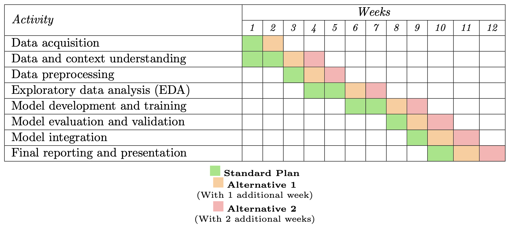

**Project Plan Template for Predicting Severe COVID-19 Cases**

## 1. Introduction

- **Context of the Project**: [Add brief explanation about COVID-19 inpatients and predicting severe outcomes.]
- **Problem Statement**: [Add details on identifying patients at risk of severe illness to enable early interventions.]
- **Stakeholders**: [List the stakeholders who will benefit, e.g., hospitals, healthcare organizations, policymakers.]

## 2. Cost/Benefit Analysis for Stakeholders

- **Benefits**: [Add information on how this predictive model will help stakeholders, including improvements in healthcare resource allocation, reduction in ICU admissions, better patient care, and financial savings.]
- **Costs**: [Detail the costs of developing and implementing the model, including technical resources, staff training, and maintenance.]
- **Return on Investment (ROI)**: [Estimate the potential return from preventing severe cases and avoiding costs.]

## 3. Framing the Problem as a Data Science Task

- **Objective**: [Define the objective of creating a predictive model to forecast severe illness based on demographic, clinical, and hospital admission data.]
- **Data**: [Identify data types and sources to be used, e.g., demographic data, clinical data, ICU admission, and outcomes.]
- **Approach**: [Outline machine learning techniques to consider, e.g., logistic regression, random forest, deep learning models, data handling methods, and evaluation metrics.]

### Objective

Our objective is to forecast severe COVID-19 illnesses among diabetes patients aged 40 to 6 in a�reproducible�and�interpretable�manner. 
Severe COVID-19 cases are defined based on these specific clinical criteria:
1. The need for intubation.
2. Requirement for artificial ventilation.
3. Hospitalization.
4. Admission to an Intensive Care Unit (ICU).

The aim is to predict these outcomes using extensive data currently accessible by the government, including:
1. Demographic data: Age, gender, ethnicity, and socioeconomic factors.
2. Clinical data: Information on comorbidities, diabetes management, and past medical history.
3. Hospital admission data: Admission status, current health metrics, and relevant treatment details.
4. Social and Behavioral Determinants of Health (SBDH): Factors like access to healthcare access, housing stability, and social support.

This data will go through preliminary pre-processing techniques in order to satisfy quality standards that assure that the model's training data is an accurate representation of the population. This will include steps such as cleaning the data and analyzing it to ensure that the demographical makeup of the data matches the target population to ensure reproducibility.

During modeling, interpretability will be assured through the prioritization of simple transparent models and the utilization model agnostic
tools such as SHAP (Shapley Additive Explanations) and Counterfactual Explanations to provide explanations on the relationships between the inputs and the results. This will allow us to ensure that the predictive model is comprehensible by clinicians and healthcare professionals, as they must be capable of understanding the model's predictions to make informed, life-altering decisions for the patients. Similarly, proving the replicability of the results across different hospitals and regions will allow healthcare professionals to trust that the model is robust and reliable.

Since our main objective is to reduce hospital resource usage and false positives have a low resource cost, the evaluation techniques to be used will be mainly sensitivity (true positive rate) and metrics like the F2 score over other evaluation metrics such as precision (positive predictive value).

### Data

In this section, we will delve into:

1.  The actual data we expect to get from each source
2.  the integrability
3.  ethical concerns
4.  completeness
5.  data cleanliness and required reconciliation

#### Data provided

As described in the objective section, our data will be sourced from:

1.  Demographic data.
2.  Clinical data.
3.  Hospital admission data.
4.  Social and Behavioral Determinants of Health (SBDH).

#### Data access and formats

To ensure a smooth and efficient integration of all datasets into our data science pipeline, we have outlined the following expectations and requirements for how the data should be provided to our team. These guidelines will help us manage data integration, access, and formatting effectively.

##### Acceptable formats

We expect data to be delivered in standard formats compatible with our systems to ease their processing and integration. Preferred formats include:

-   CSV: Comma-separated values for structured data, suitable for demographic, clinical, hospital admission, and SBDH data. The CSV files should contain clear column headers and consistent data types.
-   JSON/XML: For semi-structured data, such as social and behavioral determinants of health (SBDH), or if the data contains hierarchical or nested information (e.g., survey results, API outputs).
-   Parquet: For larger datasets that need efficient storage and compression, especially for clinical or hospital admission data.
-   SQL/Database Exports: If data is stored in a relational database, we will accept exports in SQL format or direct access to database dumps (e.g., MySQL, PostgreSQL) where applicable.

##### Metadata

All data files should be well-documented, with data dictionaries provided to explain the meaning of each variable and with time stamping to accurately track when the data was captured.

Every dataset should come with metadata that explains:

-   Field descriptions (e.g., what each column represents).
-   Units of measure, data types, and constraints.
-   Assumptions made during data collection.
-   Data Dictionary: A data dictionary outlining all variables, their types, potential categories, and ranges, if applicable.
-   Codebook: If data contains coded values (e.g., for demographic fields), a codebook explaining the meaning of each code should be included.
-   Source Documentation: Clear documentation of where the data originates (e.g., hospitals, clinical trials, surveys) and how it has been collected.
-   Transformation Records: A log of any transformations (e.g., filtering, aggregating, normalizing) applied to the data from collection to delivery. This is crucial for understanding how raw data has evolved to its final form.
-   Version Control: Assurances that data updates or changes (e.g., new entries, modifications) are tracked with proper version control, so historical data can be reviewed or reverted.

##### Data Access

To facilitate efficient data integration, the data should be accessible by our data science team in a controlled and secure environment. We expect:

-   Single Point of Access: All data should be consolidated in a single location or repository to minimize delays. The preferred options are cloud-based folders or a shared database.
-   Role-Based Access: Access to data should be restricted based on roles, ensuring that only authorized personnel can retrieve sensitive information (e.g., clinical data).
-   Version Control: If the data will be updated periodically (e.g., clinical or hospital admission data), we require a versioning system to track changes and prevent data corruption or inconsistency during analysis.

#### Ethical concerns

Due to the sensitive nature of the data sources involved in this project, we must address the main ethical concerns of the data we will receive: data privacy and confidentiality. All data should have gone through a process of anonymization to ensure that patients cannot be identified. Similarly, only data that is strictly necessary for the analysis will be provided to decrease the probability of identifying individuals through their unique situations. This will be detailed further in the Risk Analysis section.

#### Completeness

Some comments as to how much missing data we will allow. In columnar data, where we can ascertain with metrics the missing data, something like 80% percent of data must be there. In non-columnar data, no idea.

#### Data Quality

**Identifier consistency.**

-   Unique and Stable Identifiers: Each entity (e.g., patient, hospital) should have a unique and persistent identifier (e.g., patient ID). These identifiers should remain consistent across different datasets and data handoffs.
-   No Duplicate Identifiers: The data attributes should not have overlapping identifiers (e.g. two 'Temperature' attributes for one patient).
-   Format Consistency: Identifiers must have consistent formats across datasets. For instance, if an identifier is numeric in one dataset, it should not be alphanumeric in another.

**Unit consistency**. All quantitative measurements (e.g., weight, height, temperature, time, distance) must use consistent units across datasets and should come with clearly stated units for each variable to ensure no misinterpretation of the data during analysis.

**Erroneous inputs.** The data provided should have gone through a basic value validation, checking that all values are within the allowed ranges.

**Missing data.**A policy on the handling of missing data should be provided in order to ensure that all missing values are treated correctly during the data science process.

#### Representative data

To ensure that the model's results will be replicable in practice, we will require that the data used be representative of the predicted target population.

Firstly, each individual sampled should belong to the demographic subset we aim to predict, i.e. patients diagnosed with diabetes aged 40 to 60, and the empirical distribution, both the marginal distribution of the features and the joint distributions, used should closely follow the theoretical distribution of these features in our target population. This sampling should be extensive enough to capture possibly critical subgroups and decrease the margin of error due to the sampling process. This includes having a balanced class distribution.

Secondly, the data should be sampled from time periods and geographical locations relevant to the target population. In our case, we expect the individuals sampled to represent the geographical density distributions of Spain's territory and to be from the last year to correctly represent the rapidly changing nature of COVID-19.

Thirdly, the data should be independent, without duplicates, and avoid highly correlated cases from sampling within family units.

### Approach

In this project, we will consider a range of machine-learning techniques tailored to predict severe COVID-19 outcomes among diabetes patients. The primary focus will be on balancing predictive power with interpretability to ensure the model's results can be understood and trusted by healthcare professionals. Below is an outline of the techniques and methods that will be used.

#### Data Pre-processing

In this phase, we will ensure the quality and consistency of the data before modeling. First, missing data will be handled using appropriate imputation techniques, such as mean or mode imputation for basic patterns, while more sophisticated methods like K-Nearest Neighbors (KNN) imputation may be applied to complex missing data patterns.

Continuous variables like vitals and lab results will be standardized to a uniform scale when possible, to ensure consistent input across models. In cases where they do not follow normal distributions, we will try transformations, such as logarithmic transformations, to obtain a more similar one. In the cases where this does not perform well, we will use transformations to other distributions, such as exponential or beta distributions. After this, outliers in the data will be identified and addressed to avoid skewing model predictions.

Lastly, class imbalance is expected, with fewer severe cases than non-severe, so we will use methods such as SMOTE to balance the training data.

#### Feature Subset Selection

To improve model performance and ensure interpretability, we will use feature selection techniques to create several subsets of features to train the models.

Firstly, filter feature selection specifically Recursive Feature Elimination (RFE) will be used to remove less important features, using metrics of feature relevance, such as Chi-Square and Mutual Information.

Secondly, we will employ a wrapper method for feature subset selection (FSS) using a small Multi-Layer Perceptron (MLP) as the evaluation model, combined with an annealing-based search strategy. This approach will help explore the feature space more efficiently by allowing for both local and global exploration, minimizing the risk of getting trapped in suboptimal feature combinations.

The annealing process begins by randomly selecting a subset of features and training the MLP model on this subset. The performance is evaluated using cross-validation, and at each iteration, we make small random adjustments to the feature set by adding or removing features. The modified feature subset is then evaluated, and the decision to accept the new subset is based on a probability that decreases over time (the "cooling schedule"), allowing for less optimal solutions early in the process but gradually focusing on the best-performing feature sets as the method progresses.

The MLP will be kept shallow to reduce complexity and avoid overfitting during the search process. Its ability to capture nonlinear feature interactions provides the flexibility needed to find optimal feature combinations while still maintaining a manageable model size.

This annealing-based approach will allow us to efficiently search the feature space for a globally optimal subset, balancing exploration and exploitation to ensure we select the most relevant features for predicting severe COVID-19 outcomes. The final subset of features will be used for model training and evaluation in later stages of the project.

#### Modeling

Several machine-learning models will be explored during the modeling phase. We will begin with logistic regression as a baseline due to its simplicity and interpretability, allowing us to understand which variables are critical to predicting severe cases. Next, we will implement more advanced models like Random Forest, which combines multiple decision trees for higher accuracy while providing insight into feature importance. For further refinement, Gradient Boosting Machines (such as XGBoost) will be used to improve accuracy by correcting errors iteratively. If necessary, we will explore deep learning models, though their complexity and reduced interpretability mean they will only be considered if they show significant performance gains.

#### Evaluation Metrics

To evaluate model performance, we will use a set of carefully chosen metrics. We will use ROC-AUC, Cohen's Kappa, Sensitivity (or True Positive Rate), and F2 scores to evaluate the models. Where there are clear optimal models, we will prioritize Sensitivity scores.

Robustness will be assured through the utilization of bias-corrected 10-fold cross-validation to ensure these scores accurately represent the behavior of the model in real-world cases.
## 4. Work Plan & Detailed Task Breakdown

- **Task Breakdown**:
  - **Data Description and Understanding**: [Add analysis of the dataset (demographics, clinical data, ICU admissions, etc.) including key features, distributions, and data quality assessment.]
  - **Data Preprocessing**: [Explain steps to prepare the data, including handling missing data, encoding categorical variables, scaling numerical data.]
  - **Exploratory Data Analysis (EDA)**: [Add a summary of EDA to understand relationships, identify patterns, and discover potential predictors of severe illness.]
  - **Model Development and Testing**: [Describe the process of building, training, and validating the predictive model, including model selection and tuning.]
  - **Model Implementation**: [Detail how the model will be integrated into hospital systems for real-time predictions.]
  - **Model Evaluation**: [Provide methods to evaluate model performance, such as accuracy, precision, recall.]
  - **Risk Assessment and Mitigation**: [Identify risks and strategies to mitigate them, e.g., data privacy, model bias.]
  - **Final Reporting and Presentation**: [Prepare a comprehensive report and presentation for stakeholders.]

- **Work Packages**: [Organize tasks into work packages reflecting different phases of the project, from data understanding to model deployment.]

- **Gantt Chart**: [Provide a Gantt chart that visually represents the timeline, highlighting key milestones and deadlines.]

- **Budget**: [Estimate the budget for the project, including costs such as computational resources, human resources.]

## 5. Risk Analysis

### Task Breakdown

#### 1.	Data Acquisition

-	Collect data from hospitals, medical centers, laboratories, Electronic Health Reports (EHR) in order to create a unified dataset.
-	Organize and catalog the information collected identifying data types, their sources, the variables and the amount of data available to enable a more efficient management.
-	Evaluate the quality of the information collected by checking for incomplete records or errors in the data ensuring data integration and consistency. This is crucial to ensure that they are suitable for use in data science analysis.

These three steps ensure that data are accessible, well documented, and able to provide valuable results.

#### 2.	Data and Context Understanding

-	Implement an initial exploratory analysis (summary statistics and basic visualizations) to get a preliminary view of the data, understanding the distribution and identifying any suspicious patterns or outliers in the data.
-	Collaborate with healthcare professionals to interpret variables and their relevance to severe Covid-19 outcomes in diabetic patients. This ensures that the variables are correctly understood, and that the analysis is aligned with clinical reality.

These steps are fundamental to starting a robust data science analysis applied to healthcare to ensure that the analysis has a meaningful impact on decision making about severe Covid-19 outcomes in diabetic patients.

#### 3.	Data Preprocessing

-	Clean the data by handling outliers, addressing missing values or correcting errors. This is crucial to ensure that the analysis is accurate, and results are not biased by incorrect data.
-	Socialize with the healthcare professionals the outliers we find that may need some investigation as in certain cases, outliers may be clinically relevant and should be investigated further before a decision is made.
-	Transform categorical variables into numerical values in order to be able to use them correctly in the machine learning algorithms to be implemented. This can be done by using techniques such as one hot encoding, label encoding, ordinal encoding and more.
-	Scale numerical features to ensure that all these variables are in the same range, facilitating comparison and analysis. This can be done by standardization and normalization techniques such as min-max scaling, robust scaling, max-absolute scaling and more.
-	Implement feature engineering to improve model performance and ensure interpretability. Create or select the features that better capture the relationships between the data and the clinical problem in order to improve the accuracy of the model. In the medical context this is especially important because data is often complex and can benefit from the inclusion of new variables. This can be done with techniques such as Recursive Feature Elimination, Feature Subset Selection, Multi-Layer Perceptron and more.

#### 4.	Exploratory Data Analysis (EDA)

-	Perform a univariate analysis in order to understand each variable individually, allowing to detect how each variable is distributed and possible anomalies in it.
-	Perform a bivariate analysis to determine the relationship between two variables, usually between a predictor variable and the target variable, this helps to understand how an individual characteristic influences or relates to the outcome.
-	Perform a multivariate analysis to identify complex relations between several variables. This is key for problems where variables interact with each other in non-trivial ways and allows the identification of important patterns or subgroups.

These analyses provide a better understanding of the behavior of the data and a better perspective for the choice of algorithms to be used in the implementation.

#### 5.	Model Development and Training

-	Select the model to be used in the project starting with a simpler model, such as logistic regression, to get a basic understanding of the problem, given that simple models tend to be more interpretable, and then try more advanced models, such as Random Forest, to improve performance and to capture more complex patterns in the data.
-	Perform a hyperparameter tunning to obtain the best combination of hyperparameters in order to improve model performance. This can be done with techniques such as grid search or randomized search.
-	Separate the dataset into training, testing and validation data. Train the model with the set of training data and adjust the model to capture the relationships present in the data.

#### 6.	Model Evaluation and Validation

-	Test the model on the testing dataset to obtain an unbiased assessment of the model’s performance on the data it has not seen before.
-	Obtain performance metrics that provide a quantitative assessment of the model’s performance, helping to determine its effectiveness, accuracy and reliability. These metrics allow to measure how the model performs on the data, identify possible errors or limitations and compare it to other models. We will use ROC-AUC, Cohen's Kappa, Sensitivity (or True Positive Rate), and F2 scores to evaluate the models.
-	Generate detailed reports on all the evaluation metrics performed.
-	Review results with the healthcare professionals in order to assess practical utility and interpretability.

#### 7.	Model Integration

-	Develop a functional application that allows the execution of the model in an efficient, accurate and appropriate way, respecting the technical and scalability requirements.
-	Create an intuitive interface for healthcare professionals to input data and receive the response of the model.
-	Integrate the application into the hospitals HER system ensuring security policies and regulations.

#### 8.	Final Reporting and Presentation
-	Documents the methodology, all the findings, recommendations, usage of the application and all the important information that need to be communicated to the healthcare professionals that will be using the application.
-	Collect feedback for future improvements on the model.

### Work Packages

-	**(Package 1):** Data acquisition and understanding
    - Data acquisition
    - Data and context understanding

    *Weeks 1-2*

-	(**Package 2):** Data analysis
    - Data preprocessing
    - EDA

    *Weeks 3-5*

-	**(Package 3):** Model implementation and evaluation
    - Data development and training
    - Model evaluation and validation
    - Model integration

    *Weeks 6-13*

-	**(Package 4):** Reporting
    - Final reporting and presentation

    *Week 14*

### Gantt Chart

**Milestones:**
- **End of Week 1:** Obtention of the data completed and well documented.
- **End of Week 2:** Initial data and context understanding completed.
- **End of Week 3:** Data preprocessed completed.
- **End of Week 5:** Exploratory analysis completed.
- **End of Week 8:** Model developed, best model selected and training completed.
- **End of Week 11:** Model evaluated and validated with clinical input.
- **End of Week 13:** Model integrated into the clinical systems.
- **End of Week 14:** Final report and presentation prepared.

### Budget

**Human Resources**
- **2 Data Scientist:** 2 * (14 weeks * 2.500/week) = 2 * (35.000) = 70.000
- **1 Data Engineer:** 14 weeks * 2.500/week = 35.000
- **1 Software Engineer:** 4 weeks * 2.500/week = 10.000
- **2 Clinical Consultants:** 2 * (6 weeks * 3.000/week) = 2 * (18.000) = 36.000
- **1 Project Manager:** 14 weeks * 3.000/week = 42.000

  **Total Human Resources:** 193.000

**Computational Resources**
- **Servers and Cloud Computing:** 15.000
- **Software Licenses:** 5.000

  **Total Computational Resources:** 20.000

**Other**
-	**Staff Training:** 10.000
-	**Meetings and Workshops:** 3.000

    **Total Others:** 13.000

**Total Estimated Budget:** 226.000

### 5. Risk Analysis

In implementing this project, it is crucial to identify and mitigate potential risks to ensure its success and maximize its positive impact on the hospital and its patients. However, we recognize that, despite our best efforts, there may be risks that cannot be entirely eliminated. We are committed to doing everything possible to minimize them, although some may still persist.

#### 5.1 Data Risks

- The data may be incomplete, have missing values, or be biased. If the data is not properly cleaned or understood, there is a risk of drawing incorrect conclusions.

The quality and integrity of the data are essential for developing an accurate predictive model. Poor data can lead to inaccurate predictions, negatively affecting clinical decision-making.

**Mitigation:**

- **Data Cleaning and Validation:** We will implement rigorous data cleaning processes to identify and correct inconsistencies or missing values.
- **Exploratory Analysis:** We will conduct thorough analyses to detect and correct potential biases in the data.
- **Multidisciplinary Collaboration:** We will work closely with medical staff to understand the context of the data and ensure its correct interpretation.

**Non-Mitigable Risks:** Despite these measures, there may be hidden biases or unknown confounding variables in the data that cannot be identified with current techniques. Additionally, the quality of historical data may limit the model's accuracy, and some critical data may be inaccessible due to legal or ethical restrictions.

#### 5.2 Model Risks

**Issue:** The model may exhibit biases in predictions, limitations in accuracy, and challenges in scalability.

**Analysis:** A biased or inaccurate model can lead to erroneous clinical decisions. Scalability is crucial to adapt to an increasing volume of data and users.

**Mitigation:**

- **Cross-Validation:** We will use advanced validation techniques to assess and improve the model's accuracy.
- **Continuous Monitoring and Updating:** We will establish mechanisms to monitor the model's performance and update it regularly.
- **Technical Scalability:** We will design the model with a flexible architecture that allows scaling according to the hospital's needs.

**Non-Mitigable Risks:** The model may not capture all clinical complexities or respond adequately to sudden changes in disease patterns, such as the emergence of new COVID-19 variants. Some inherent limitations of current predictive models may prevent 100% accuracy.

#### 5.3 Ethical and Privacy Risks

**Issue:** Handling sensitive patient data involves challenges regarding privacy and compliance with regulations like GDPR.

**Analysis:** Patient confidentiality is paramount. Any breach can result in legal penalties and reputational damage.

**Mitigation:**

- **Regulatory Compliance:** We will ensure strict adherence to all applicable privacy regulations.
- **Data Anonymization:** We will apply anonymization and pseudonymization techniques to protect patient identities.
- **Informed Consent:** We will ensure that all data used has the appropriate consent.

**Non-Mitigable Risks:** Despite implementing strong security measures, there is always a residual risk of data breaches due to advanced cyber threats or inadvertent human errors. It is not possible to guarantee absolute protection against all potential vulnerabilities.

#### 5.4 Operational Risks

**Issue:** Difficulties may arise when implementing the model in the hospital environment and training staff.

**Analysis:** Successful implementation requires technological integration and acceptance by staff. Without proper adaptation, the project may not achieve its objectives.

**Mitigation:**

- **Phased Implementation Plan:** We will deploy the model in stages to minimize disruptions and facilitate adjustments.
- **Comprehensive Training:** We will provide training to staff, including workshops and support materials.
- **Continuous Support:** We will offer technical and operational assistance to resolve any post-implementation issues.

**Non-Mitigable Risks:** There may be resistance to change from staff that cannot be completely overcome, even with training and support. Additionally, limitations in technological infrastructure or budget constraints may prevent optimal implementation.

#### 5.5 Acknowledgment of Non-Mitigable Risks

We recognize that, despite our efforts to identify and mitigate risks, some factors may be beyond our control:

- **Pandemic Evolution:** Unpredictable changes in the virus, such as mutations or new variants, can affect the relevance and accuracy of the model based on historical data.
- **Socioeconomic and Cultural Factors:** External elements like health policies, population behaviors, or economic conditions may influence outcomes and may not be fully captured by the model.
- **Technological Limitations:** Current tools and technologies have inherent limits that may prevent the full achievement of the project's objectives.
- **Dependence on External Collaboration:** The project's success partly depends on ongoing collaboration with hospital staff and other stakeholders, which may vary and not be entirely under our control.

We are committed to doing everything possible to minimize these risks and adapt to changing circumstances. We will maintain open communication with all involved parties to quickly identify any issues and seek joint solutions.

## 6. Viability Analysis

- **Technological Feasibility**: [Assess the availability of data, computational resources, and technical skills.]
- **Financial Feasibility**: [Determine if the potential cost justifies the expected benefits.]
- **Operational Feasibility**: [Analyze how easily the model can be implemented in a hospital setting.]

### Final Deliverables

- **Project Plan Document**: [Include sections like introduction, cost/benefit analysis, data science framing, detailed task breakdown, Gantt chart, risk analysis, and viability analysis.]
- **Presentation**: [Prepare a short presentation (5-10 slides) summarizing the project plan.]

### Evaluation Criteria

- **Clarity**: [Ensure the problem and project goals are well explained.]
- **Feasibility**: [Assess the practicality of the project plan, including timeline and budget.]
- **Completeness**: [Ensure all sections are included and properly detailed.]
- **Data Understanding**: [Provide a deep analysis and description of the dataset.]

